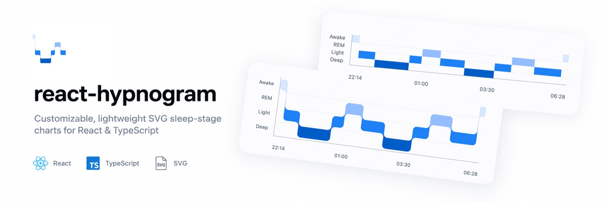

# react-hypnogram

Customizable, lightweight SVG sleep-stage charts (Hypnograms) for React and TypeScript.

[](https://github.com/CrazyBucket/react-hypnogram/actions)
[](LICENSE)



- **Pure SVG Rendering**: Crisp on high-DPI screens, responsive, zero heavy charting dependencies.
- **Smooth Geometry**: Automatic rounded corners and seamless gradient transitions between sleep stages.
- **Customizable Stages**: Flexible stage definitions, colors, and linear gradient fills (Awake, REM, Light, Deep or custom).
- **Interactive**: Built-in hover/selection highlights and custom tooltip rendering.
- **TypeScript First**: Full type safety for interval data, stages, and options.

## Installation

```sh
npm install react-hypnogram
```

## Quick Start

```tsx
import { Hypnogram } from 'react-hypnogram';
import type { HypnogramSegment } from 'react-hypnogram';

const data: HypnogramSegment[] = [
  { id: '1', stage: 'awake', start: '2026-09-09T22:14:00+08:00', end: '2026-09-09T22:32:00+08:00' },
  { id: '2', stage: 'light', start: '2026-09-09T22:32:00+08:00', end: '2026-09-09T23:10:00+08:00' },
  { id: '3', stage: 'deep',  start: '2026-09-09T23:10:00+08:00', end: '2026-09-10T00:28:00+08:00' },
  { id: '4', stage: 'rem',   start: '2026-09-10T00:28:00+08:00', end: '2026-09-10T01:10:00+08:00' },
];

export function App() {
  return (
    <Hypnogram
      data={data}
      time={{ timeZone: 'Asia/Shanghai' }}
      radius={12}
      barHeight={26}
      rowGap={12}
      onSegmentClick={segment => console.log('Clicked segment:', segment.id)}
    />
  );
}
```

No external CSS required. The component adopts container width automatically.

## Development

```sh
# Install dependencies
npm install

# Start playground development server
npm run dev

# Run tests and typecheck
npm test
npm run typecheck

# Full CI verification (tests, lint, build, size)
npm run check
```

## Documentation

- [API Reference (中文)](docs/api.md)
- [Time & Data Guide (中文)](docs/time-and-data.md)
- [Contributing](CONTRIBUTING.md)

## License

[MIT](LICENSE)
